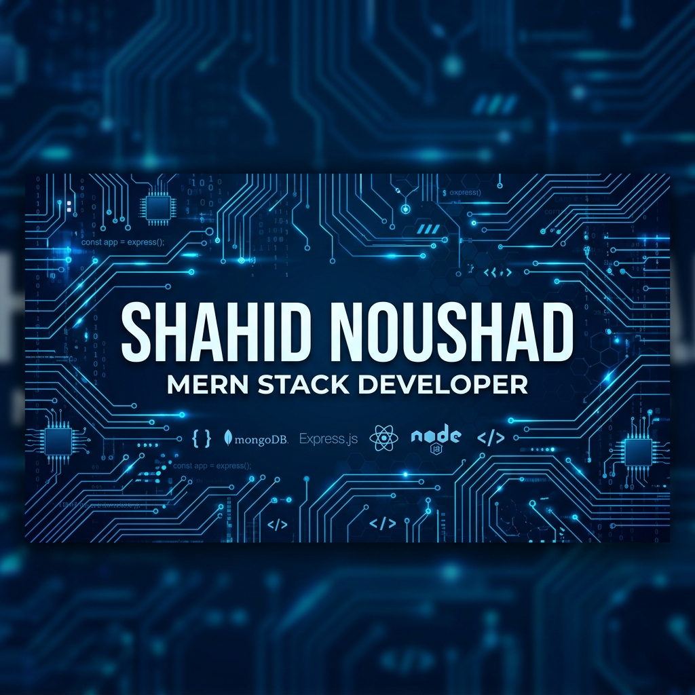

  

# Shahid Noushad

**Backend-Focused MERN Developer | System Design Enthusiast**

## About Me

I am a backend-focused developer with experience in designing scalable APIs, optimizing database performance, and building real-world applications using Node.js and MongoDB. I focus on writing clean, maintainable backend systems with a strong emphasis on performance, caching strategies, and system design.

* Strong in Node.js, Express.js, and REST API design
* Experience with MongoDB schema design and query optimization
* Applied Redis caching for performance improvements
* Implemented authentication systems with JWT and refresh tokens
* Interested in scalable architectures and backend engineering

## Featured Project

### Gravital – Scalable Social Media System

A full-stack social media platform designed with a focus on backend architecture, performance optimization, and system design.

**Backend Highlights:**
* Designed scalable REST APIs using Node.js and Express
* Implemented JWT authentication with refresh token strategy
* Applied Redis caching to reduce database load
* Optimized MongoDB queries using indexing
* Integrated AWS S3 for media handling

**Explore:**
* Backend: [Gravital-Server](https://github.com/shahid123s/Gravital-Server)
* Frontend: [Gravital-Client](https://github.com/shahid123s/Gravital-Client)
* System: [Gravital-system](https://github.com/shahid123s/Gravital-system)

## Tech Stack

**Backend**
Node.js | Express.js | REST APIs

**Database & Caching**
MongoDB | Redis

**Frontend**
React.js | HTML | CSS

**Cloud & Tools**
AWS S3 | Git | Postman

## Core Focus Areas

* Designing scalable backend systems
* Writing clean and maintainable APIs
* Performance optimization and caching
* Real-world system design thinking

## Current Focus

* Improving backend architecture skills
* Strengthening system design understanding
* Exploring scalable and real-time systems

## Connect

* **LinkedIn:** [shahid-noushad](https://www.linkedin.com/in/shahid-noushad/)
* **GitHub:** [shahid123s](https://github.com/shahid123s)
* **Email:** [shahidnoushad.official@gmail.com](mailto:shahidnoushad.official@gmail.com)
